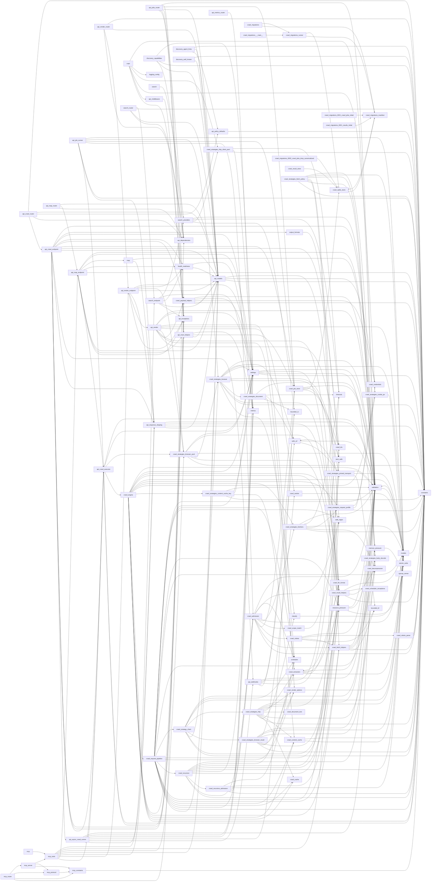

```mermaid
graph LR
    api_async_crawl_runner --> api_crawl_executor
    api_async_crawl_runner --> api_response_shaping
    api_async_crawl_runner --> api_webhooks
    api_async_crawl_runner --> crawl_job_store
    api_async_crawl_runner --> metrics
    api_async_crawl_runner --> settings
    api_async_crawl_runner --> validation
    api_crawl_endpoint --> api_async_crawl_runner
    api_crawl_endpoint --> api_crawl_executor
    api_crawl_endpoint --> api_exceptions
    api_crawl_endpoint --> api_main_helpers
    api_crawl_endpoint --> api_response_shaping
    api_crawl_endpoint --> api_webhooks
    api_crawl_endpoint --> api_models
    api_crawl_endpoint --> crawl_ids
    api_crawl_endpoint --> crawl_job_store
    api_crawl_endpoint --> crawl_payload_helpers
    api_crawl_endpoint --> health_readiness
    api_crawl_endpoint --> metrics
    api_crawl_endpoint --> output_formats
    api_crawl_endpoint --> validation
    api_crawl_executor --> api_exceptions
    api_crawl_executor --> constants
    api_crawl_executor --> crawl_engine
    api_crawl_executor --> crawl_strategies_browser_pool
    api_crawl_executor --> settings
    api_crawl_executor --> validation
    api_crawl_router --> api_crawl_endpoint
    api_crawl_router --> api_dependencies
    api_crawl_router --> api_policy_defaults
    api_crawl_router --> api_models
    api_crawl_router --> constants
    api_job_runner --> api_crawl_executor
    api_job_runner --> api_response_shaping
    api_job_runner --> constants
    api_job_runner --> crawl_admission
    api_job_runner --> crawl_job_store
    api_job_runner --> crawl_strategies_browser
    api_job_runner --> models
    api_jobs_router --> api_dependencies
    api_jobs_router --> api_exceptions
    api_jobs_router --> api_main_helpers
    api_jobs_router --> api_models
    api_jobs_router --> crawl_job_store
    api_jobs_router --> crawl_payload_helpers
    api_jobs_router --> validation
    api_main_helpers --> api_models
    api_main_helpers --> crawl_job_store
    api_main_helpers --> metrics
    api_map_endpoint --> api_crawl_executor
    api_map_endpoint --> api_exceptions
    api_map_endpoint --> api_main_helpers
    api_map_endpoint --> api_models
    api_map_endpoint --> constants
    api_map_endpoint --> health_readiness
    api_map_endpoint --> map
    api_map_endpoint --> settings
    api_map_endpoint --> validation
    api_map_router --> api_dependencies
    api_map_router --> api_map_endpoint
    api_map_router --> api_models
    api_metrics_router --> metrics
    api_middleware --> api_exceptions
    api_policy_defaults --> constants
    api_render --> crawl_ids
    api_render --> crawl_payload_helpers
    api_render --> crawl_render_options
    api_render --> crawl_result_helpers
    api_render --> crawl_strategies_browser_pool
    api_render --> crawl_worker
    api_render --> models
    api_render --> scheduler
    api_render --> settings
    api_render --> validation
    api_render_endpoint --> api_exceptions
    api_render_endpoint --> api_render
    api_render_endpoint --> api_response_shaping
    api_render_endpoint --> api_models
    api_render_endpoint --> crawl_strategies_browser_pool
    api_render_endpoint --> health_readiness
    api_render_endpoint --> settings
    api_render_router --> api_dependencies
    api_render_router --> api_render_endpoint
    api_render_router --> api_models
    api_render_router --> constants
    api_response_shaping --> api_models
    api_response_shaping --> constants
    api_response_shaping --> crawl_llm_format
    api_response_shaping --> validation
    api_webhooks --> bounded_io
    api_webhooks --> crawl_strategies_pinned_transport
    api_webhooks --> safe_url
    api_webhooks --> timeouts
    api_webhooks --> validation
    api_models --> constants
    api_models --> crawl_credentials
    api_models --> safe_regex
    classify --> models
    crawl_admission --> constants
    crawl_admission --> crawl_fetch_helpers
    crawl_admission --> crawl_job_store
    crawl_admission --> crawl_robots
    crawl_admission --> crawl_scope_match
    crawl_admission --> crawl_strategies_fetchers
    crawl_admission --> models
    crawl_admission --> safe_regex
    crawl_admission --> scheduler
    crawl_admission --> validation
    crawl_content_cache --> atomic_write
    crawl_content_cache --> constants
    crawl_engine --> constants
    crawl_engine --> crawl_cache
    crawl_engine --> crawl_content_cache
    crawl_engine --> crawl_fetch_helpers
    crawl_engine --> crawl_payload_helpers
    crawl_engine --> crawl_request_pipeline
    crawl_engine --> crawl_strategies_content_cache_key
    crawl_engine --> crawl_strategies_cookie_jar
    crawl_engine --> crawl_strategies_fetchers
    crawl_engine --> crawl_strategies_request_profile
    crawl_engine --> models
    crawl_engine --> resource_pressure
    crawl_engine --> safe_regex
    crawl_engine --> settings
    crawl_engine --> validation
    crawl_extraction --> crawl_llm_format
    crawl_extraction --> models
    crawl_extraction --> resource_pressure
    crawl_extraction --> validation
    crawl_fetch_helpers --> bounded_ttl
    crawl_fetch_helpers --> constants
    crawl_fetch_helpers --> crawl_decompression
    crawl_fetch_helpers --> crawl_strategies_body_decode
    crawl_fetch_helpers --> validation
    crawl_job_store --> crawl_ids
    crawl_job_store --> crawl_sqlite_store
    crawl_job_store --> json_safe
    crawl_job_store --> validation
    crawl_llm_format --> crawl_extraction
    crawl_migrations --> crawl_migrations_manifest
    crawl_migrations --> crawl_migrations_runner
    crawl_migrations_0001_crawl_jobs_initial --> crawl_migrations_manifest
    crawl_migrations_0001_results_initial --> crawl_migrations_manifest
    crawl_migrations_0002_crawl_jobs_drop_canonicalized --> crawl_sqlite_store
    crawl_migrations___main__ --> crawl_migrations_runner
    crawl_migrations_manifest --> crawl_sqlite_store
    crawl_migrations_runner --> crawl_migrations_manifest
    crawl_migrations_runner --> crawl_sqlite_store
    crawl_payload_helpers --> api_models
    crawl_payload_helpers --> constants
    crawl_payload_helpers --> crawl_credentials
    crawl_payload_helpers --> settings
    crawl_payload_helpers --> validation
    crawl_recursive --> constants
    crawl_recursive --> crawl_admission
    crawl_recursive --> crawl_recursive_admission
    crawl_recursive --> crawl_result_helpers
    crawl_recursive --> metrics
    crawl_recursive --> models
    crawl_recursive --> resource_pressure
    crawl_recursive --> safe_regex
    crawl_recursive --> scheduler
    crawl_recursive --> validation
    crawl_recursive_admission --> constants
    crawl_recursive_admission --> crawl_admission
    crawl_recursive_admission --> metrics
    crawl_recursive_admission --> models
    crawl_recursive_admission --> resource_pressure
    crawl_recursive_admission --> scheduler
    crawl_render_options --> models
    crawl_request_pipeline --> api_models
    crawl_request_pipeline --> constants
    crawl_request_pipeline --> crawl_admission
    crawl_request_pipeline --> crawl_cache
    crawl_request_pipeline --> crawl_content_cache
    crawl_request_pipeline --> crawl_fetch_helpers
    crawl_request_pipeline --> crawl_ids
    crawl_request_pipeline --> crawl_recursive
    crawl_request_pipeline --> crawl_render_options
    crawl_request_pipeline --> crawl_result_helpers
    crawl_request_pipeline --> crawl_strategy_chain
    crawl_request_pipeline --> memory_pressure
    crawl_request_pipeline --> models
    crawl_request_pipeline --> resource_pressure
    crawl_request_pipeline --> safe_regex
    crawl_request_pipeline --> scheduler
    crawl_request_pipeline --> settings
    crawl_request_pipeline --> validation
    crawl_result_helpers --> constants
    crawl_result_helpers --> crawl_decompression
    crawl_result_helpers --> crawl_scheduler_exceptions
    crawl_result_helpers --> models
    crawl_result_store --> crawl_sqlite_store
    crawl_robots --> bounded_ttl
    crawl_robots --> crawl_fetch_helpers
    crawl_robots --> crawl_robots_parse
    crawl_robots --> validation
    crawl_robots_parse --> constants
    crawl_scope_match --> safe_regex
    crawl_sqlite_store --> crawl_migrations_manifest
    crawl_strategies_browser --> classify
    crawl_strategies_browser --> constants
    crawl_strategies_browser --> crawl_result_helpers
    crawl_strategies_browser --> crawl_strategies_document
    crawl_strategies_browser --> crawl_strategies_pinned_transport
    crawl_strategies_browser --> json_safe
    crawl_strategies_browser --> models
    crawl_strategies_browser --> safe_url
    crawl_strategies_browser --> settings
    crawl_strategies_browser --> validation
    crawl_strategies_browser_pool --> constants
    crawl_strategies_browser_pool --> crawl_result_helpers
    crawl_strategies_browser_pool --> crawl_strategies_browser
    crawl_strategies_browser_pool --> models
    crawl_strategies_browser_pool --> resource_pressure
    crawl_strategies_browser_pool --> settings
    crawl_strategies_browser_result --> constants
    crawl_strategies_browser_result --> crawl_extraction
    crawl_strategies_browser_result --> crawl_render_options
    crawl_strategies_browser_result --> crawl_result_helpers
    crawl_strategies_browser_result --> crawl_strategies_body_decode
    crawl_strategies_browser_result --> crawl_worker
    crawl_strategies_browser_result --> models
    crawl_strategies_browser_result --> validation
    crawl_strategies_content_cache_key --> constants
    crawl_strategies_content_cache_key --> crawl_content_cache
    crawl_strategies_content_cache_key --> settings
    crawl_strategies_content_cache_key --> validation
    crawl_strategies_cookie_jar --> atomic_write
    crawl_strategies_document --> bounded_io
    crawl_strategies_document --> crawl_extraction
    crawl_strategies_document --> safe_url
    crawl_strategies_document --> timeouts
    crawl_strategies_document --> validation
    crawl_strategies_fetch_policy --> constants
    crawl_strategies_fetch_policy --> crawl_decompression
    crawl_strategies_fetch_policy --> crawl_fetch_helpers
    crawl_strategies_fetch_policy --> crawl_result_helpers
    crawl_strategies_fetch_policy --> crawl_strategies_body_decode
    crawl_strategies_fetch_policy --> models
    crawl_strategies_fetch_policy --> validation
    crawl_strategies_fetchers --> constants
    crawl_strategies_fetchers --> crawl_decompression
    crawl_strategies_fetchers --> crawl_strategies_request_profile
    crawl_strategies_fetchers --> models
    crawl_strategies_fetchers --> timeouts
    crawl_strategies_fetchers --> validation
    crawl_strategies_http --> classify
    crawl_strategies_http --> constants
    crawl_strategies_http --> crawl_cache
    crawl_strategies_http --> crawl_content_cache
    crawl_strategies_http --> crawl_decompression
    crawl_strategies_http --> crawl_document_text
    crawl_strategies_http --> crawl_extraction
    crawl_strategies_http --> crawl_render_options
    crawl_strategies_http --> crawl_result_helpers
    crawl_strategies_http --> models
    crawl_strategies_http --> validation
    crawl_strategies_http_client_pool --> constants
    crawl_strategies_http_client_pool --> settings
    crawl_strategies_http_client_pool --> timeouts
    crawl_strategies_pinned_transport --> bounded_ttl
    crawl_strategies_pinned_transport --> models
    crawl_strategies_pinned_transport --> safe_url
    crawl_strategies_pinned_transport --> validation
    crawl_strategies_request_profile --> constants
    crawl_strategies_request_profile --> crawl_credentials
    crawl_strategies_request_profile --> crawl_strategies_cookie_jar
    crawl_strategy_chain --> constants
    crawl_strategy_chain --> crawl_result_helpers
    crawl_strategy_chain --> crawl_strategies_browser
    crawl_strategy_chain --> crawl_strategies_browser_result
    crawl_strategy_chain --> crawl_strategies_http
    crawl_strategy_chain --> models
    crawl_strategy_chain --> scheduler
    crawl_strategy_chain --> validation
    crawl_worker --> models
    discovery_agent_hints --> api_policy_defaults
    discovery_agent_hints --> api_models
    discovery_agent_hints --> constants
    discovery_capabilities --> api_dependencies
    discovery_capabilities --> api_models
    discovery_capabilities --> constants
    discovery_capabilities --> settings
    discovery_well_known --> api_models
    discovery_well_known --> constants
    health_readiness --> api_models
    health_readiness --> metrics
    main --> api_exceptions
    main --> api_middleware
    main --> crawl_strategies_cookie_jar
    main --> crawl_strategies_http_client_pool
    main --> logging_config
    main --> validation
    map --> api_response_shaping
    map --> validation
    mcp --> mcp_tools
    mcp_constants --> constants
    mcp_protocol --> mcp_constants
    mcp_router --> api_dependencies
    mcp_router --> mcp_constants
    mcp_router --> mcp_protocol
    mcp_router --> mcp_server
    mcp_server --> mcp_constants
    mcp_server --> mcp_protocol
    mcp_server --> mcp_tools
    mcp_tools --> api_crawl_executor
    mcp_tools --> api_map_endpoint
    mcp_tools --> api_render_endpoint
    mcp_tools --> api_response_shaping
    mcp_tools --> api_models
    mcp_tools --> crawl_strategies_browser_pool
    mcp_tools --> json_safe
    mcp_tools --> search_endpoint
    memory_pressure --> cgroup_sense
    models --> constants
    models --> validation
    output_formats --> json_safe
    resource_pressure --> cgroup_sense
    resource_pressure --> memory_pressure
    resource_pressure --> validation
    safe_url --> crawl_strategies_pinned_transport
    safe_url --> validation
    search --> search_providers
    search_endpoint --> api_exceptions
    search_endpoint --> api_models
    search_endpoint --> health_readiness
    search_endpoint --> metrics
    search_endpoint --> search_providers
    search_providers --> bounded_io
    search_providers --> crawl_strategies_http_client_pool
    search_providers --> timeouts
    search_providers --> validation
    search_router --> api_dependencies
    search_router --> api_models
    search_router --> constants
    search_router --> search_endpoint
    settings --> constants
    settings --> memory_pressure
    settings --> resource_pressure
    settings --> validation
    validation --> models
```
